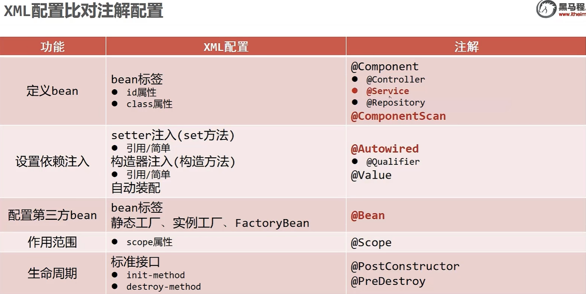
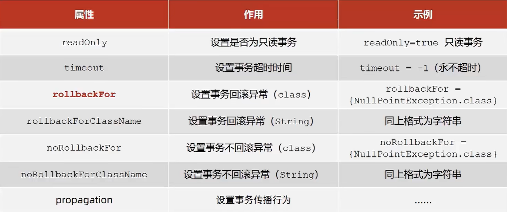
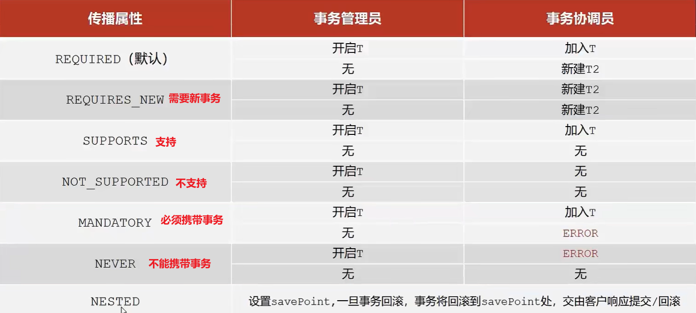
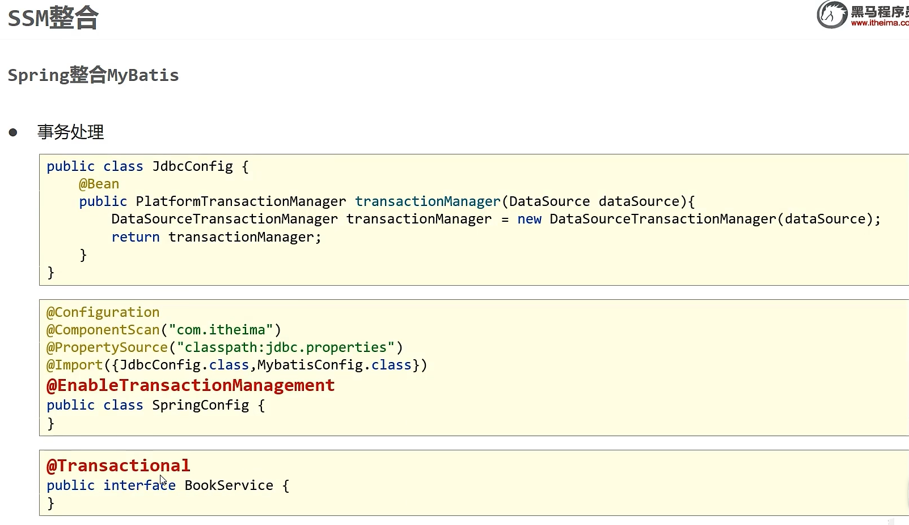
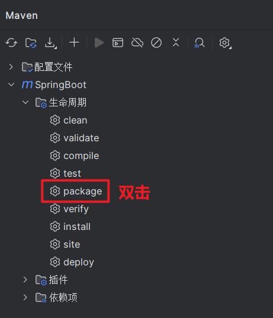
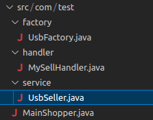

> 注意：由于本笔记大量使用OCR截图文字识别，所以会出现部分代码缺少等号或者字母出错，缺少的注解可以去黑马提供的笔记中的“知识点”部分寻找

# 核心思想：充分解耦

* IoC : 由主动new产生对象转换为由外部提供对象，此过程中对象创建控制权由程序转移到外部，此思想称为控制反转

* bean：Ioc容器负责对象的创建、初始化等一系列工作，被创建或被管理的对象在IoC容器中统称为Bean

* IOC容器：管理bean，在IoC容器内将有依赖关系的bean进行关系绑定
* 效果：使用对象时不仅可以直接从Ioc容器中获取，并目获取到的bea已经绑定了所有的依赖关系 

# 注解开发

## SpringConfig

`@Configuration`代表这是一个配置类

`@ComponentScan("com.orion")`,配置多个扫描包时用数组：`@ComponentScan({"com.orion.service","com.orion.dao"})`

### 使用包扫描引入(不能快速知道引入了哪些配置类)

详见Spring_day02 4.3.1

### 使用`@Import`引入

这种方案**要引用的类**可以不用加`@Configuration`注解，但是必须在Spring配置类上使用`@Import`注解手动引入
需要加载的配置类
步骤1:去除JdbcConfig类上的注解
步骤2:在Spring配置类中引入

#### 注意!:

* 扫描注解可以移除(也就是说可以不ComponentScan这个包)
* `@Import`参数需要的是一个数组，可以引入多个配置类。
* `@Import`注解在配置类中只能写一次!

## 自动装配：(括号内为示例)

### 引用类型：@Autowired按类型注入和附加@Qualifier("bookDao2")改用按名称注入

暴力反射，不用提供setter

建议使用无参构造方法创建对象（默认），不然造不出对象

### 简单类型（包括String）：@Value("itheima")

### properties（以配置jdbc.properties的name为例）

在SpringConfig类前加上`@PropertySource("classpath:jdbc.properties")`**一定一定要加`classpath:`!!!**

配置多个properties请用数组：`@PropertySource({"classpath:jdbc.properties","classpath:jdbc.properties"})`

**不支持使用通配符！如**`*.properties`

然后你要用到的属性前`@Value("${name}")`

### 第三方bean

`@Bean`后没加括号就会按类型匹配，因为加载SpringConfig时会加载这些配置，所以我们直接：

* 按类型匹配(请脑补代码补全)：

  ```java
  new ACAC;//叫ctx
  ctx.getBean(DataSource.class);
  ```

#### DataSource

```java
@Configuration
@ComponentScan("com.orion")
@PropertySource("classpath:jdbc.properties")
@Import({JdbcConfig.class})//多个请用数组，单个不用加大括号也行
public class SpringConfig{
}
```

```java
public class JdbcConfig {
    //1. 先提供一个方法用来获得对应的bean
	//2. 添加@Bean，表明该方法返回值是个Bean
	@Bean
	public DataSource dataSource5(){
    	DruidDataSource ds = new DruidDataSource();
    	ds.setDriverClassName("com.mysql.jdbc.Driver");
    	ds.setUrl("jdbc:mysql://localhost:3306/spring_db");
    	ds.setUserName("root");
    	ds.setPassword("123456");
    	return ds;
	}
}
```

**注意:不能使用`DataSource ds = new DruidDataSource()`**

因为DataSource接口中没有对应的setter方法来设置属性。

#### 为第三方bean注入资源

引用类型放方法形参里，会自动装配

简单类型就当成员变量

```java
public class JdbcConfig {
    @Value("com.mysql.jdbc.Driver")
	private String driver;
	@Value("jdbc:mysq1://localhost:3306/spring_db")
	private String url;
	@Value("root")
	private String userName;
	@Value("123456")
	private String password;
	@Bean
	public DataSource dataSource5(BookDao bookDao){
    	DruidDataSource ds new DruidDataSource();
		ds.setDriverclassName(driver);
		ds.seturl(url);
		ds.setUsername(userName);
		ds.setPassword(password);
		return ds;
	}
}
```

## 总结



# Spring整合Mybatis

多import一个就行

```java
@Configuration
@ComponentScan("com.orion")
@PropertySource("classpath:jdbc.properties")
@Import({JdbcConfig.class,MybatisConfig.class})//多个请用数组，单个不用加大括号也行
public class SpringConfig{
}
```


要导的包

```xml
<dependency>
	<groupId>org.springframework</groupId>
	<artifactId>spring-jdbc</artifactId>
	<version>5.2.10.RELEASE</version>
</dependency>
<dependency>
	<groupId>org.mybatis</groupId>
	<artifactId>mybatis-spring</artifactId>
	<version>1.3.0</version>
</dependency>
```

只有加注释的地方是动态的，其他地方都是固定格式

```java
public class MybatisConfig {
	@Bean
	public SqlSessionFactoryBean sqlSessionFactory(DataSource dataSource){
		SqlSessionFactoryBean ssfb new SqlSessionFactoryBean();
		ssfb.setTypeAliasesPackage("com.itheima.domain");//扫描类型别名的
		ssfb.setDataSource(dataSource);
		return ssfb;
    }
	@Bean
	public MapperScannerConfigurer mapperScannerConfigurer(){
		MapperScannerConfigurer msc new MapperScannerConfigurer();
		msc.setBasePackage("com.itheima.dao");//扫描映射的包
		return msc;
    }
}
```

## 补充（摘自黑马的SSM笔记）：FactoryBean都是造对象的

查看源码会发现，FactoryBean接口其实会有三个方法，分别是:

```java
T getObject() throws Exception;

Class<?> getObjectType();

default boolean isSingleton() {
		return true;
}
```

方法一:getObject()，被重写后，在方法中进行对象的创建并返回

方法二:getObjectType(),被重写后，主要返回的是被创建类的Class对象

方法三:没有被重写，因为它已经给了默认值，从方法名中可以看出其作用是设置对象是否为单例，默认true

# Spring整合JUnit

下面是一个测试类示例，前两行是固定格式

```java
@RunWith(SpringJUnit4ClassRunner.class)
@ContextConfiguration(classes = SpringConfig.class)
public class AccountServiceTest {
	@Autowired
	private AccountService accountService;
	@Test
	public void testFindById(){
		System.out.println(accountService.findById(2));
    }
}
```

# AOP（摘自青空の霞光）
首先我们需要在主类添加`@EnableAspectJAutoProxy`注解，开启AOP注解支持：

```java
@EnableAspectJAutoProxy
@ComponentScan("com.test.bean")
@Configuration
public class MainConfiguration {
}
```

接着我们只需在定义AOP增强操作的类上添加`@Aspect`注解和`@Component`将其注册为Bean即可，就像我们之前在配置文件中也要将其注册为Bean：

```java
@Component
@Aspect
public class AopTest {

}
```

接着，我们直接在里面编写方法，并将此方法添加到一个切点中，比如我们希望在Student的test方法执行之前执行我们的方法：

```java
public int test(String str){
    System.out.println("我被调用了:"+str);
    return str.length();
}
```

只需要添加`@Before`注解即可：

```java
@Before("execution(* com.test.bean.Student.test(..))")
public void before(){
    System.out.println("我是之前执行的内容！");
}
```

同样的，我们可以为其添加`JoinPoint`参数来获取切入点信息：

```java
@Before("execution(* com.test.bean.Student.test(..))")
public void before(JoinPoint point){
    System.out.println("参数列表："+ Arrays.toString(point.getArgs()));
    System.out.println("我是之前执行的内容！");
}
```

我们也可以使用`@AfterReturning`注解来指定方法返回后的操作：

```java
@AfterReturning(value = "execution(* com.test.bean.Student.test(..))", returning = "returnVal")
public void after(Object returnVal){
    System.out.println("方法已返回，结果为："+returnVal);
}
```

我们还可以指定returning属性，并将其作为方法某个参数的实参。同样的，环绕也可以直接通过注解声明：

```java
@Around("execution(* com.test.bean.Student.test(..))")
public Object around(ProceedingJoinPoint point) throws Throwable {
    System.out.println("方法执行之前！");
    Object val = point.proceed();
    System.out.println("方法执行之后！");
    return val;
}
```
## 注解执行的位置
```java
 //把这个类声明为一个切面：需要把该类放入到IOC容器中，再声明为一个切面
    @Aspect
    @Component
    public class LogginAspect {

        //声明该方法是一个前置通知：在目标方法开始之前执行
        @Before("execution(public int com.wul.spring.aop.impl.AtithmeticCalculator.*(int ,int))")
        public void beforeMethod(JoinPoint joinPoint) {
            String methodName = joinPoint.getSignature().getName();
            List<Object> args = Arrays.asList(joinPoint.getArgs());
            System.out.println("The method " + methodName + " begins with " + args);
        }

        //后置通知：在目标方法之后(无论是否发生异常)，执行的通知，
        //在后置通知中还不能访问目标方法执行的结果。执行结果须在返回通知中访问。
        @After("execution(public int com.wul.spring.aop.impl.AtithmeticCalculator.*(int ,int))")
        public void afterMethod(JoinPoint joinPoint) {
            String methodName = joinPoint.getSignature().getName();
            System.out.println("The method " + methodName + " ends");

        }

        //返回通知：在目标方法正常结束执行后的通知
        //返回通知是可以访问到目标方法的返回值的
        @AfterReturning(value = "execution(public int com.wul.spring.aop.impl.AtithmeticCalculator.*(int,int))"
                , returning = "result")
        public void afterRunningMethod(JoinPoint joinPoint, Object result) {
            String methodName = joinPoint.getSignature().getName();
            System.out.println("The method " + methodName + " ends with the Result " + result);
        }


        //在目标方法出现异常时会执行的代码，
        //可以访问到异常对象，且可以指定在出现特定异常时在执行通知代码
        //如下面Exception ex，若是指定为NullpointerException ex就不会执行通知代码
        @AfterThrowing(value = "execution(public int com.wul.spring.aop.impl.AtithmeticCalculator.*(int,int))"
                , throwing = "ex")
        public void afterThrowingMethod(JoinPoint joinPoint, Exception ex) {
            String methodName = joinPoint.getSignature().getName();
            System.out.println("The method " + methodName + "occurs exception:" + ex);
        }

        //坏绕通知：需要携带ProceedingJoinPoint类型的参数
        //环绕通知类似于动态代理的全过程：ProceedingJoinPoint类型的参数可以决定是否执行目标方法
        //且环绕通知必须有返回值，返回值即目标方法的返回值。
        @Around("execution(public int com.wul.spring.aop.impl.AtithmeticCalculator.*(int,int))")
        public Object aroundMethod(ProceedingJoinPoint pjd) {
            Object result = null;
            String methodName = pjd.getSignature().getName();
            Object args = Arrays.asList(pjd.getArgs());
            //执行目标方法
            try {
                //前置通知
                System.out.println("Arround:The method " + methodName + " begins with " + args);
                result = pjd.proceed();
                //后置通知
                System.out.println("Arround:The method " + methodName + " ends");
            } catch (Throwable e) {
                e.printStackTrace();
                //异常通知
                System.out.println("Arround:The method " + methodName + "occurs exception:" + e);
                //throw new RuntimeException(e);
                //不抛出异常的话，异常就被上面抓住，执行下去，返回result，result值为null，转换为int
            } finally {
                //返回通知
                System.out.println("Arround:The method " + methodName + " ends with the Result " + result);
            }

            //return 100;
            return result;
        }

    }
```

# Spring事务

## 案例：银行账户转账

### 在业务层接口上添加Spring事务管理

Spring注解式事务通常添加在业务层接口中而不会添加到业务层实现类中，降低耦合
注解式事务可以添加到业务方法上表示当前方法开启事务，也可以添加到接口上表示当前接口所有方法开启事务

```java
public interface Accountservice {
	@Transactional
	public void transfer(String out,String in Double money);
}
```

### 设置事务管理器

事务管理器要根据实现技术进行选择
MyBatis框架使用的是]DBc事务

```java
@Bean
public PlatformTransactionManager transactionManager(DataSource dataSource){
	DataSourceTransactionManager ptm new DataSourceTransactionManager();//JDBC的事务
	ptm.setDataSource(dataSource);
	return ptm;
}
```

### 开启注解式事务驱动

```java
@Configuration
@ComponentScan("com.itheima")
@PropertySource("classpath:jdbc.properties")
@Import({JdbcConfig.class,MybatisConfig.class})
@EnableTransactionManagement//这个
public class SpringConfig{
}
```

## 事务相关配置



### 事务只有出现了error或运行时异常才会回滚

`IOException`就不属于以上两种

有些异常就是这种默认不加入回滚的，所以我们要手动给他加上

```java
public interface Accountservice {
	@Transactional(rollbackFor ={IOException.class})//在这里
	public void transfer(String out,String in ,Double money)throws IOException;
}
```

## 事务传播行为



比方说我们银行转账时，无论转账是否成功都要记录操作情况

```java
public interface LogService{
	@Transactional(propagation = Propagation.REQUIRES_NEW)//注意这行
	void log(String out,String in,Double money);
}
```

```java
@Service
public class LogServiceImpl implements LogService{
	@Autowired
	private LogDao logDao;
	//@Transactional(propagation Propagation.REQUIRES_NEW)//接口写了,实现类就不用写了
	public void log(String out,String in,Double money){
		logDao.log("转账操作由"+out+"到"+in+",金额："+money);
    }
}
```

```java
@Service
public class AccountServiceImpl implements AccountService {
	@Autowired
	private AccountDao accountDao;
	@Autowired
	private LogService logService;
    
	public void transfer(String out,String in Double money){
		try{
			accountDao.outMoney(out,money);
			int i 1/0;
			accountDao.inMoney(in,money);
		}finally{
			logService.log(out,in,money);
    	}
	}
}
```

# SpringMVC

## 入门案例

1. 导坐标

   ```xml
   <dependency>
   	<groupId>javax.servlet</groupId>
   	<artifactId>javax.servlet-api</artifactId>
   	<version>3.1.0</version>
   	<scope>provided</scope>
   </dependency>
   <dependency>
   	<groupId>org.springframework</groupId>
   	<artifactId>spring-webmvc</artifactId>
   	<version>5.2.10.RELEASE</version>
   </dependency>
   ```

2. 创建SpringMVC控制器类（等同于Servlet功能）

   ```java
   @Controller
   public class UserController {
   	@RequestMapping("/save")
   	@ResponseBody
   	public String save(){
   		System.out.println("user save ...")
   		return "{'info':'springmvc'}";
       }
   }
   ```

3. 初始化SpringMVC环境（同Spring环境），设定SpringMVC加载对应的bean

   ```java
   @Configuration
   @ComponentScan("com.itheima.controller")
   public class SpringMvcConfig {
   }
   ```

4. 初始化Servlet容器，加载SpringMVC环境，并设置SpringMVC技术处理的请求(见下)

## bean的加载格式

```java
public class ServletContainersInitConfig extends AbstractDispatcherServletInitializer{
    //加载SpringMVC配置
	protected WebApplicationcontext createservletApplicationcontext(){
		AnnotationConfigWebApplicationContext ctx new AnnotationConfigWebApplicationContext();
		ctx.register(SpringMvcConfig.class);
		return ctx;
    }
    //加载Spring配置
	protected WebApplicationcontext createRootApplicationcontext(){
		AnnotationConfigWebApplicationContext ctx new AnnotationConfigWebApplicationContext();
		ctx.register(SpringConfig.class);
		return ctx;
    }
    //把所有请求交给SpringMVC处理
	protected String[]getservletMappings(){
		return new string[]{"/"};
    }
}
```

继承`AbstractDispatcherServletInitializer`的子类更加简化开发

```java
public class ServletContainersInitConfig extends AbstractAnnotationConfigDispatcherServletInitializer {
    
	protected class<?>[]getRootConfigclasses() {
		return new class[]{SpringConfig.class};
    }
    
	protected Class<?>[]getServletConfigclasses() {
		return new class[]{SpringMvcConfig.class};
    }
    
	protected String[]getservletMappings(){
		return new String[]{"/"};
    }
}
```

对于Spring配置类加载，直接精准扫service和dao

下面是Main

```java
public class App {
	public static void main(String[]args){
		AnnotationConfigApplicationContext ctx = new AnnotationConfigApplicationContext(SpringConfig.class);
		System.out.println(ctx.getBean(UserController.class));
    }
}
```

## 请求与响应-请求

### 参数名不一致的简单类型

```java
@RequestMapping("/commonParamDifferentName")
@ResponseBody
//请求参数名和形参不一样，就用@RequestParam，把请求里面的name给到username,或者说是绑定参数关系
public String commonParamDifferentName(@RequestParam("name")String userName int age){
	System.out.print1n("普通参数传递userName=>"+userName);
	System.out.printIn("普通参数传递age=>"+age);
	return "{'module':common param different name'}";
}
```

### 实体类

如果形参是个实体类，并且传的属性名和实体类的属性名一样，它就会自动被打包成一个对象

如果你要给实体类里面的对象传值，就用“加点”的方式传


### 数组

如果传的是数组，那就是看谁的key和形参名的一样，自动打包


### List

SpringMVC对引用类型的态度是：当成一个pojo(实体类对象)，所以造一个对象，然后把对应属性值塞进去

但是对List不管用所以只要在前面加个`@RequestParam`注解，告诉它把参数都扔进去就行

```java
//集合参数
@RequestMapping("/listParam")
@ResponseBody
public String listParam(@RequestParam List<String>likes){
	System.out.printin("集合参数传递likes=>"+likes);
	return "{'module':'list param'}";
}
```

### JSON

```xml
<dependency>
	<groupId>com.fasterxml.jackson.core</groupId>
	<artifactId>jackson-databind</artifactId>
	<version>2.9.0</version>
</dependency>
```


#### 开启由JSON数据自动类型转化为对象的功能

`@EnableWebMvc`功能之一：根据类型匹配对应的类型转换器

```java
@Configuration
@ComponentScan("com.itheima.controller")
@EnableWebMvc//就是这一句
public class SpringMvcConfig {
}
```

`@RequestParam`用不了了，得用`@RequestBody`把JSON数据塞进去

```java
//集合参数：json格式
@RequestMapping("/listParamForJson")
@ResponseBody
public String listParamForJson(@RequestBody List<String>likes){
	System.out.printin("1 ist common(json)参数传递list=>"+likes);
	return "{'module':'list common for json param'}";
}
```

当然，如果形参是实体类，也是加`@RequestBody`就会自动打包

#### 日期类型参数传递

接收形参时，根据不同的日期格式设置不同的接收方式

`@DateTimeFormat(pattern = "??????")`

```java
@RequestMapping("/dataParam")
@ResponseBody
public String dataParam(Date date,
                        @DateTimeFormat(pattern = "yyyy-MM-dd")Date date1,
                        @DateTimeFormat(pattern = "yyyy/MM/dd HH:mm:ss")Date date2){
	System.out.println("参数传递date=>"+date);
	System.out.println("参数传递date(yyyy-MM-dd)==>"+date1);
	System.out.println("参数传递date(yyyy/MM/ddHH:mm:ss)=>"+date2);
	return "{'module':'data param'}";
}
```

## 请求与响应-响应

### 响应页面/跳转页面

```java
@RequestMapping("/toJumpPage")
public String toJumpPage(){
	System.out.printin("跳转页面");
	return "page.jsp";
}
```

### 响应文本数据

`@ResponseBody`设置当前控制器返回值作为响应体，不加的话它会以为这是个网页，参考上例

如果返回值是String，就当做响应体，如果是对象，就通过jackson转成可识别的数据再响应回去

```java
@RequestMapping("/toText")
@ResponseBody
public String toText(){
	System.out.println("返回纯文本数据")；
	return "response text";
}
```

### JSON-响应POJO对象

加上`@ResponseBody`，然后直接返回对象，就会自动转JSON

```java
@RequestMapping("/toJsonPOJO")
@ResponseBody
public User toJsonPOJO(){
	System.out.println("返回json对象数据")；
	Useruser new User();
	user.setName("itcast");
	user.setAge(15);
	return user;
}
```

但转JSON这事可不是SpringMVC帮我们做的，而是jackson

```xml
<dependency>
	<groupId>com.fasterxml.jackson.core</groupId>
	<artifactId>jackson-databind</artifactId>
	<version>2.9.0</version>
</dependency>
```

### JSON-响应POJO集合对象

和上面一样

```java
@RequestMapping("/to]sonList")
@ResponseBody
public List<User>toJsonList(){
	System.out.println("返回json集合数据")；
	User user1 new User();I
	user1.setName("传智播客")；
	user1.setAge(15);
	User user2 = new User();
	user2.setName("黑马程序员")；
	user2.setAge(12);
	List<User>userList new ArrayList<~>();
	userList.add(user1);
	userList.add(user2);
	return userList;
}
```

 ## REST风格

按照REST风格访问资源时使用行为动作区分对资源进行了何种操作

| 访问路径                 | 行为             | 请求方式        |
| ------------------------ | ---------------- | --------------- |
| http://localhost/users   | 查询全部用户信息 | GET(查询)       |
| http://localhost/users/1 | 查询指定用户信息 | GET(查询)       |
| http://localhost/users   | 添加用户信息     | POST(新增/保存) |
| http://localhost/users   | 修改用户信息     | PUT(修改/更新)  |
| http://localhost/users/1 | 删除用户信息     | DELETE(删除)    |

根据REST风格对资源进行访问称为RESTful

**描述摸块的名称通常使用复数**，也就是加s的格式描述，表示此类资源，而非单个资源，例如：users、books、accounts.…

加个`@PathVariable`代表变量来自访问路径（占位），然后还要用`{}`标明路径变量，告诉哪个值给谁

```java
//{id}是路径变量，下面括号先写("/users/{id}")，然后加上,method，idea会自动把前面的value=补上
@RequestMapping(value = "/users/{id}",method = RequestMethod.DELETE)
@ResponseBody
public String delete(@PathVariable Integer id){
System.out.println("user delete..."+id);
return "{'module':'user delete'}";
```

### `@RequestBody` `@RequestParam` `@PathVariable`
区别

* `@RequestParam`用于接收url地址传参或表单传参
* `@RequestBody`用于接收json数据
* `@PathVariable`用于接收路径参数，使用{参数名称)描述路径参数

应用

* 后期开发中，发送请求参数超过1个时，以封装成pojo然后采用json格式为主，`@RequestBody`应用较广
* 如果发送非json格式数据，选用`@RequestParam`接收请求参数
* 采用RESTful进行开发，当参数数量较少时，例如1个，可以采用`@PathVariable`接收请求路径变量，通常用于传递id值

### 优化

我们学到现在，一个Controoler是这样的

```java
@Controller
public class BookController {
	@RequestMapping(value = "/books", method = RequestMethod.POST)
	@ResponseBody
	public String save(@RequestBody Book book){
		System.out.println("book save..."+book);
		return "{'module':'book save'}";
    }
	@RequestMapping(value ="/books/{id}",method = RequestMethod.DELETE)
	@ResponseBody
	public String delete(@PathVariable Integer id){
		System.out.println("book delete..."+id);
		return "{'module':'book delete'}";
    }
	@RequestMapping(value = "/books", method = RequestMethod.PUT)
	@ResponseBody
	public String update(@RequestBody Bookbook){
		System.out.println("book update..."+book);
		return "{'module':'book update'}";
    }
}
```

显然我们在每个方法中都有重复的地方：`@ResponseBody`,`value = "/books", `

我们可以像之前JavaWeb优化servlet那样，同时用上更方便的注解

```java
//@Controller
//@ResponseBody
@RestController//其实就是上面2个的合二为一
@RequestMapping("/books")
public class BookController {
    
	//@RequestMapping(method = RequestMethod.POST)
    @PostMapping
	public String save(@RequestBody Book book){
		System.out.println("book save..."+book);
		return "{'module':'book save'}";
    }
    
	//@RequestMapping(value = "/{id}", method = RequestMethod.DELETE)
    @DelectMapping("/{id}")
	public String delete(@PathVariable Integer id){
		System.out.println("book delete..."+id);
		return "{'module':'book delete'}";
    }
    
	//@RequestMapping(method = RequestMethod.PUT)
	@PutMapping
    public String update(@RequestBody Bookbook){
		System.out.println("book update..."+book);
		return "{'module':'book update'}";
    }
}
```

### 放行非SpringMVC的请求

我们前面设置了`SpringConfig`下的`getServletMappings`方法把所有资源拉给SpringMVC处理，但这会造成静态资源如html，css，图片等资源也被拉去SpringMVC而非交给Tomcat处理

所以我们要添加一个资源的过滤

```java
//记得在SpringConfig那边@Import一下
public class SpringMvcSupport extends WebMvcConfigurationSupport {
@Override
protected void addResourceHandlers(ResourceHandlerRegistry registry){
    //给page目录添加一个资源的处理器，当访问/pages/????的时候，走/pages目录下的内容
	registry.addResourceHandler("/pages/**").addResourceLocations("/pages/");
	registry.addResourceHandler("/js/**").addResourceLocations("/pages/");
	registry.addResourceHandler("/css/**").addResourceLocations("/pages/");
	registry.addResourceHandler("/plugins/**").addResourceLocations("/pages/");
}
```

#### 知识点抽查

```java
@Insert("insert into tbl_book (type,name,description)values(#{type},#{name),#{description))")
```

前面括号内的是表里面的字段名，后面括号内的才是实体类的属性



### 关于“No converter found for return value of type: class xxx”的解决方法

如果xxx是一个pojo，给它加个`@Getter` `@Setter`

[Spring Boot：关于“No converter found for return value of type: class xxx”的解决方法](https://blog.csdn.net/ruananqing/article/details/83099180)

```java
//@RestControllerAdvice用于标识当前类为REST风格对应的异常处理器类
@RestControllerAdvice
public class ProjectExceptionAdvice {
    //除了自定义的异常处理器，保留对Exception类型的异常处理，用于处理非预期的异常
    @ExceptionHandler(Exception.class)//定义用来处理哪一种异常
    //通过形参把异常对象传进来
    public Result doException(Exception ex){
      	System.out.println("嘿嘿,异常你哪里跑！");
        return new Result(666,null,"嘿嘿,异常你哪里跑！");
    }
}
```

### Postman乱码

去idea把编码全转换成utf-8

# SpringBoot

## 快速启动



到jar包所在文件夹打开cmd，

```markdown
java -jar s
```

然后按tab补全

## package前记得clean


---

# 复习-代理

代理类完成的功能：
1.目标类中方法的调用
2.功能增强

## 反射

```java
Class<?> clazz = Class.forName("com.test.Student");
Object instance = clazz.newInstance();//创建出学生对象
Method method = clazz.getDeclaredMethod("test", String.class);
//通过方法名和形参类型获取类中的方法
method.setAccessible(true);
method.invoke(instance, "what's up");//通过Method对象的invoke方法来调用方法
```

其中，`invoke方法`用来调用，显而易见，上面的`method`对象是通过`Student类`的`class对象`得到的

所以这时`invoke方法`需要俩参数才能正确实现代理：`实例化对象`和`被代理方法的参数`

## 静态代理

工厂(目标)和商家(代理)都要实现`Seller`这个接口，

而`Seller`接口只有一个sell方法，接收订单数(参数)，根据订单数返回单价(返回值)

```java
public interface Seller {
    public float sell(int amount);
}
```

工厂实现这个接口时

```java
public class UsbFactory1 implements Seller{
    @Override
    public float sell(int amount) {
        //这里先统一工厂1售价为85元
        return 85.0f;
    }
}
```

而商家实现这个接口时

```java
public class TaoBao implements Seller{
    //指定卖方
    private Seller factory1 = new UsbFactory1();
    
    @Override
    public float sell(int amount) {
        //向工厂发送订单，获取单价
        float price = factory1.sell(amount);
        //商家对价格进行处理(增强功能)
        price = price + 25;
        return price;
    }
}
```

然后用户找淘宝购买

```java
public class ShopMain{
	public static void main(string[]args){
		//创建代理的商家taobao对象
		TaoBao taoBao = new TaoBao();
		float price = taoBao.sell(1);
		System.out.println("通过淘宝的商家，购买u盘单价：" + price);
    }
}
```

## 动态代理



### 售卖接口

```java
package com.test.service;

public interface UsbSeller {
    int sell(int amount);
}
```

### A工厂实现接口进行卖货(后期可以添加更多工厂进行功能细分)

```java
package com.test.factory;

import com.test.service.UsbSeller;

public class UsbFactory implements UsbSeller {
    @Override
    public int sell(int amount) {
        System.out.println("工厂在卖货,售价85");
        return 85;
    }
}
```

### 创建动态代理

```java
package com.test.handler;

import java.lang.reflect.InvocationHandler;
import java.lang.reflect.Method;

public class MySellHandler implements InvocationHandler {
    private Object target = null;

    //动态代理目标是不固定的
    public MySellHandler(Object target) {
        this.target = target;
    }

    @Override
    public Object invoke(Object proxy, Method method, Object[] args) throws Throwable {
        //结果初始化为null
        Object res = null;
        //调用目标方法
        res = method.invoke(target, args);
        System.out.println("商家进货");

        //进行功能增强
        res = (int) res + 25;
        System.out.println("商家加价，当前售价：" + res);
        return res;
    }
}
```

### Main方法调用

```java
package com.test;

import com.test.factory.UsbFactory;
import com.test.handler.MySellHandler;
import com.test.service.UsbSeller;

import java.lang.reflect.Proxy;

public class MainShopper {
    public static void main(String[] args) {
        //1.创建目标对象
        UsbSeller usbFactory = new UsbFactory();
        //2. 创建InvocationHandler对象
        MySellHandler mySellHandler = new MySellHandler(usbFactory);
        //3. 创建代理对象
        UsbSeller proxyInstance = (UsbSeller) Proxy.newProxyInstance(usbFactory.getClass().getClassLoader(),
                usbFactory.getClass().getInterfaces(),
                mySellHandler);
        //4. 通过动态代理里执行方法
        proxyInstance.sell(1);
    }
}
```

