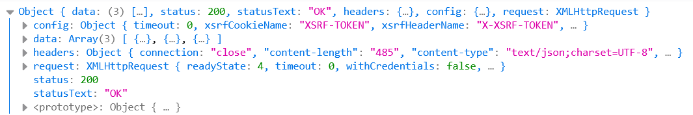

npm run serve

```vue
<template>
<!--  应该动态获取真实来源提供给蒙版显示-->
<!--  它里面要的数据就可以从返回结果里去取-->
  <h1>{{msg}}</h1>
</template>

<script>
//const options = {};export default options;照抄就行，这是约定
const options = {
  // function返回的结果对象是模板要的数据
  data: function () {
    return {msg: "你好！"};
  }
};
export default options;
</script>

<style>

</style>
```


`<template>`里只能有一个根元素

你不能

```vue
<template>
	<h1>{{name}}</h1>
	<h1>{{age}}</h1>
</template>
```

但是可以

```vue
<template>
  <div>
    <h1>{{ name }}</h1>
    <h1>{{ age }}</h1>
  </div>
</template>
```


# 属性绑定

```vue
<template>
    <div>
        <input type="text" v-bind:value="name"><br>
        <input type="date" v-bind:value="birthDate"><br>
        <input type="text" :value="age">
    </div>
</template>
<script>
const options = {
    data: function () {
        return {name: '张三', birthDate:'1995-05-01',age: '27'};
    }
};
export default options;
</script>
```

# 事件绑定

```vue
<template>
    <div>
        <div><input type="button" value="+1" @click="m1"><br></div>
        <div><input type="button" value="-1" @click="m2"><br></div>
        <div>{{ count }}</div>
    </div>
</template>
<script>
const options = {
        data: function () {
            return {count: 0};
        },
        methods: {
            m1() {
                //这里的this代表整个data部分返回的数据
                this.count++;
            },
            m2() {
                this.count--;
            }
        }
    }
;
export default options;
</script>
```

==m1()后面不用加冒号==

# 双向绑定：把用户输入端数据同步回JavaScript

```vue
<template>
    <div>
        <div>
            <label for="">请输入姓名</label>
            <input type="text" name="name" v-model="name">
        </div>
        
        <div>
            <label for="">请输入年龄</label>
            <input type="text" name="age" v-model="age">
        </div>
        
        <div>
            <label for="">请选择性别</label>
            男<input type="radio" name="sex" value="男" v-model="sex">
            女<input type="radio" name="sex" value="女" v-model="sex">
        </div>
        
        <div>
            <label for="">请输入你的爱好</label>
            游泳<input type="checkbox" name="hobby" value="游泳" v-model="hobby">
            打球<input type="checkbox" name="hobby" value="打球" v-model="hobby">
            跑步<input type="checkbox" name="hobby" value="跑步" v-model="hobby">
        </div>
    </div>
</template>
<script>
const options = {
        data: function () {
            // 多选要用数组来表示，[]表示都没选中，['打球']就是默认勾选打球
            return {name: null, age: "20", sex: "男", hobby: ['打球']};
        },
        methods: {
            m1() {
                //这里的this代表整个data部分返回的数据
                this.count++;
            },
            m2() {
                this.count--;
            }
        }
    }
;
export default options;
</script>
```

# v-model和v-bind的选择

v-model通常配合表单相关标签使用，如

* 文本框
* 密码框
* 单选、多选

其他标签

* 内容用文本插值
* 普通标签属性用`:value`


---


# 计算属性

和methods区别就是他可以直接当属性用，不用像方法那样还要在方法名后加个`()`调用

有缓存，==属性值没变动情况下==，只有在第一次执行时才会计算

```vue
<template>
    <div>
        <div>
            {{ fullName }}
            {{ fullName }}
            {{ fullName }}
        </div>
    </div>
</template>
<script>
const options = {
        data: function () {
            return {firstName: "John", lastName: "Doe"};
        },
        computed: {
            fullName() {
                console.log('调用了fullName');
                return this.lastName + this.firstName;
            }
        }
    }
;
export default options;
</script>
```

# axios

## 发送请求

### 演示

到项目文件夹下执行！

```vue
<template>
<div></div>
</template>
<script>
import axios from "axios"
const options = {
        methods:{
            async sendRequest(){
                //我们配置过了，所有以/api打头的请求会由代理间接访问到Tomcat的http://localhost:8080
                //所以咱走7070的/api就行
                //promise结果代表的是响应对象，所以用const resp接收
                const resp = await axios.get('/api/students');//同步方式获取：等拿到响应结果再向下运行
                console.log(resp);//必须要用一次resp，没办法先这样一下
            }
        }
    }
;
export default options;
</script>
```

### 发送请求携带请求参数（在url地址后）

```vue
<template>
    <div></div>
</template>
<script>
import axios from "axios"
const options = {
        methods: {
            async sendRequest() {
                const resp = await axios.post('/api/students', {}, {
                    //发送请求携带请求参数，会自动字符串拼接和特殊字符的url编码
                    params: {
                        name: '&&&&',
                        age: '20'
                    }
                });
                
                console.log(resp);
            }
        }
    }
;
export default options;
</script>
```

### 用请求体发数据

#### 格式为url编码

普通对象发数据的时候是json格式，所以如果想要是url编码的格式，要用urlSearchParams的对象

```vue
<template>
    <div></div>
</template>
<script>
import axios from "axios"
const options = {
        methods: {
            async sendRequest() {
                const params = new URLSearchParams();
                params.append("name", "张三");
                params.append("age", 24);
                const resp = await axios.post('/api/test', params);
                console.log(resp);
            }
        }
    }
;
export default options;
</script>
```

#### 格式为multipart

```vue
<template>
    <div></div>
</template>
<script>
import axios from "axios"
const options = {
        methods: {
            async sendRequest() {
                const params = new FormData();
                params.append("name", "张三");
                params.append("age", 24);
                const resp = await axios.post('/api/test', params);
                console.log(resp);
            }
        }
    }
;
export default options;
</script>
```

服务器这边接收数据的格式，除了JSON不一样，其他方法接收格式都是类似的

不管是url的查询参数，还是url编码或者multipart格式的数据，都可以用如下示方法来接

```java
@PostMapping("/api/a4")
public string a4(String name,Integer age) {
	System.out.println("name: " + name + "age: " + age);
	return "post request";
}
```

当然也可以合成一个对象来接

#### 格式为json

```vue
<template>
    <div></div>
</template>
<script>
import axios from "axios"
const options = {
        methods: {
            async sendRequest() {
                const resp = await axios.post('/api/a5json', {
                name: '王五',
                age: 50
            });
                console.log(resp);
            }
        }
    }
;
export default options;
</script>
```

### 改默认配置(暂未学)

```vue
<template>
    <div></div>
</template>
<script>
import axios from "axios"

const options = {
        methods: {
            async sendRequest() {
                const _axios = axios.create({});//大括号内是要修改的默认配置项
                const resp = await _axios.post('/api/test', {
                    name: 'test',
                    age: 50
                });
                console.log(resp);
            }
        }
    }
;
export default options;
</script>
```

# Element UI

## 表格组件

### 请求体数据的使用

```vue
<template>
    <div>
        <el-table v-bind:data="brands">
            <el-table-column label="编号" prop="id"></el-table-column>
            <el-table-column label="品牌名" prop="brandName"></el-table-column>
            <el-table-column label="公司名" prop="companyName"></el-table-column>
            <el-table-column label="排序权重" prop="ordered"></el-table-column>
            <el-table-column label="描述" prop="description"></el-table-column>
            <el-table-column label="状态" prop="status"></el-table-column>
        </el-table>
    </div>
</template>

<script>

import axios from "axios";

const options = {
    data() {
        return {
            brands : [],
            total:0
        }
    },
    mounted() {
        //提高作用范围，我们要调用的是return里面的brands
        const _this = this;
        axios.post('api/JavaWeb/queryServlet')
            //第一个data是拿到响应体，第二个data是拿到响应体里的学生集合，不要加()
            .then(function (resp) {
                _this.brands = resp.data;
                console.log(resp);
            })
    }
}

export default options;
</script>
```

为什么是`resp.data`?

通过执行`console.log(resp)`发现，



我们要的数据在data里面，所以是`resp.data`而不是`resp.data.brands`

## 分页组件

```vue
<template>
    <div>
        <!--
        前面有冒号的代表要去找对应值做数据绑定，找不到的会当成表达式解析
        如果把这些找不到的前面冒号去掉，会当成普通字符串，不进行解析
        如下面的:total="50"
        -->
        <el-table v-bind:data="brands">
            <el-table-column label="编号" prop="id"></el-table-column>
            <el-table-column label="品牌名" prop="brandName"></el-table-column>
            <el-table-column label="公司名" prop="companyName"></el-table-column>
            <el-table-column label="排序权重" prop="ordered"></el-table-column>
            <el-table-column label="描述" prop="description"></el-table-column>
            <el-table-column label="状态" prop="status"></el-table-column>
        </el-table>
        
        <!--分页-->
        <el-pagination
            :total="50"
            :page-size="queryDto.size"
            :current-page="queryDto.page"
            layout="prev,pager,next,sizes,->,total"
            :page-sizes="[1,5,10,15,20]"
            @current-change="currentChange"
            @size-change="sizeChange"
        ></el-pagination>
    </div>
</template>

<script>

import axios from "axios";

// 发请求的情况：第一次加载，改变页码，改变分页行数
const options = {
    data() {
        return {
            brands: [],
            queryDto: {
                page: 1,
                size: 5
            }
        }
    },
    methods: {
        currentChange(page) {
            this.queryDto.page = page;
            console.log("Current change: " + this.queryDto.page)
        },
        sizeChange(size) {
            this.queryDto.size = size;
            console.log("sizeChange: " + this.queryDto.size)
        },
        query() {
            const _this = this;
            axios.post('api/JavaWeb/queryServlet')
                .then(function (resp) {
                    _this.brands = resp.data;
                    console.log(resp);
                })
            // axios.get('api/JavaWeb/queryServlet', {
            //     params: this.queryDto
            // })
        }
    },
    mounted() {
        this.query();
    }
}

export default options;
</script>
```


只有methods要用data的属性是才要加this

空参调用方法要写括号