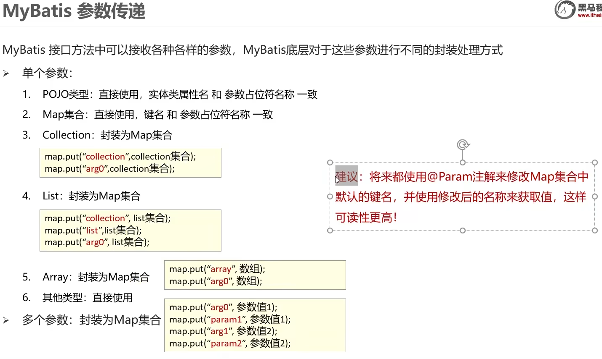
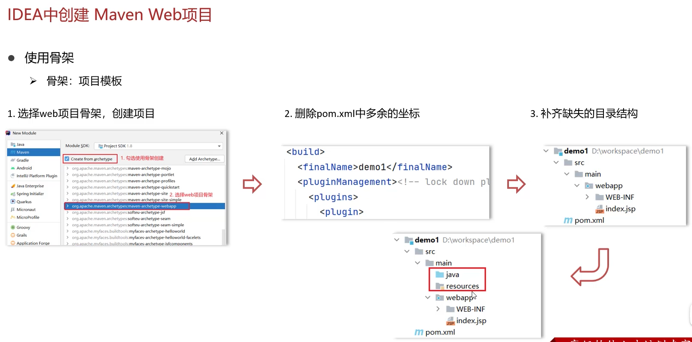
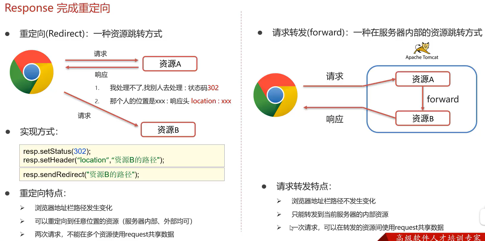
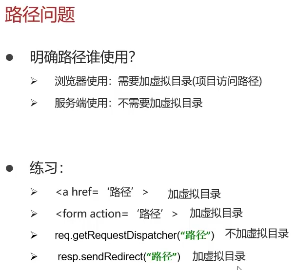
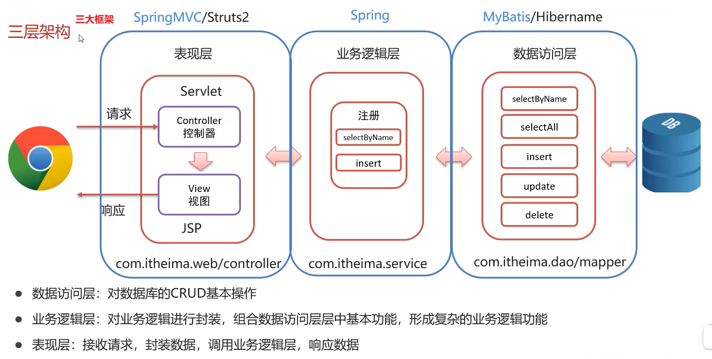

# Mybatis

## 条件查询

### 接口方法

接口默认方法都是public，可以省略public

#### 参数接收

##### 方法一：使用散装参数

如果方法中有多个参数，需要使用`@param("SQL 参数占位符名称")`

```java
List<Brand> selectByCondition(@Param("status") int status, @Param("companyName") String companyName, @Param("brandName") String brandName);
```

##### 方法二：封装对象

```java
List<Brand> selectByCondition(Brand brand)
```

##### 方法三：使用Map包装

```java
List<Brand> selectByCondition(Map map);
```


#### 单条件动态查询

```java
List<Brand> selectByConditionSingle(Brand brand);
```

#### 多条件动态查询（这里演示下用Map）

```java
List<Brand> selectByCondition(Map map);
```

#### 直接使用注解开发的动态查询示例：写@ResultMap

```java
@Select("select * from tb_brand where id = #{id}")
@ResultMap("brandResultMap")//数据库和pojo类命名不一致，用ResultMap补救一下
Brand testAnnotationsSelectById(int id);
```

### 接口的配置文件

#### 只要==要查询的==表中含有单词拼接的名字，就要进行字段映射

```xml
<!--
id：唯一标识
type：映射的类型，支持别名
com.orion.pojo.Brand写成brand没问题，但是会爆红
-->
<resultMap id="brandResultMap" type="com.orion.pojo.Brand">
    <!--
    id：完成主键字段映射
        column：表的列名
        property：实体类的属性名
    result：完成一般字段的映射
        column：表的列名
        property：实体类的属性名
    -->
    <result column="brand_name" property="brandName"/>
    <result column="company_name" property="companyName"/>
</resultMap>
```

当碰到小于号时，可能会和标签识别冲突
可以使用转义字符`&lt;`
或者写个CD，然后回车，小于号写括号里面，他会当做纯文本处理

#### RusultMap写好后，后面配置文件的ResultType记得换成brandResultMap

#### 单条件动态查询

使用`where标签`，自动判断要不要去掉开头的and和加上where 1=1

`<choose>`相当于switch

`<when test="status != null">`相当于case

```xml
<select id="selectByConditionSingle" resultMap="brandResultMap">
    select *
    from tb_brand
    <!--使用where标签，自动判断要不要去掉开头的and和加上where 1=1-->
    <where>
        <choose><!--相当于switch-->
            <when test="status != null"><!--相当于case-->
                status = #{status}
            </when>

            <when test="companyName != null and companyName != ''">
                company_name = #{companyName}
            </when>

            <when test="brandName != null and brandName != ''">
                brand_name = #{brandName}
            </when>
        </choose>
    </where>
</select>
```

#### 多条件动态查询

使用`where标签`，自动判断要不要去掉开头的and和加上where 1=1

使用`if`实现动态SQL

```xml
<select id="selectByCondition" resultMap="brandResultMap">
    select *
    from tb_brand
    <!--使用where标签，自动判断要不要去掉开头的and和加上where 1=1-->
    <where>
        <!--使用if实现动态SQL-->
        <if test="status != null">
            and status = #{status}
        </if>
        <if test="companyName != null and companyName != ''">
            and company_name like #{companyName}
        </if>
        <if test="brandName != null and brandName != ''">
            and brand_name like #{brandName}
        </if>
    </where>
</select>
```

### 执行方法

#### 接收参数后一定要记得处理参数

```java
    //处理参数(这个以后也要自己写)
    companyName = "%" + companyName + "%";
    brandName = "%" + brandName + "%";
```

#### 单条件动态查询

```java
@Test
    public void testSelectByConditionSingle() throws IOException {
        //接收参数
        int status = 1;
        String companyName = "华为";
        String brandName = "华为";

        //处理参数(这个以后也要自己写)
        companyName = "%" + companyName + "%";
        brandName = "%" + brandName + "%";

        //用于List<Brand> selectByCondition(Brand brand)
        //封装对象
        Brand brand = new Brand();
//        brand.setStatus(status);
        brand.setCompanyName(companyName);
//        brand.setBrandName(brandName);

        //单条件就不用Map了
        //用于Map方法查找
//        Map map = new HashMap();
//        map.put("status", status);
//        map.put("companyName", companyName);
//        map.put("brandName", brandName);//测试动态SQL

        //1.获取SqlSessionFactory
        String resource = "mybatis-config.xml";
        InputStream inputStream = Resources.getResourceAsStream(resource);
        SqlSessionFactory sqlSessionFactory = new SqlSessionFactoryBuilder().build(inputStream);

        //2.获取SqlSession对象
        SqlSession sqlSession = sqlSessionFactory.openSession();

        //3.获取Mapper接口的代理对象
        BrandMapper brandMapper = sqlSession.getMapper(BrandMapper.class);

        //4.执行方法
        //只有这行代码要自己写，剩下的靠框架
        //当然了，还有Mapper配置文件的SQL语句
        List<Brand> brands = brandMapper.selectByConditionSingle(brand);
        System.out.println(brands);

        //5.释放资源
        sqlSession.close();
    }
```

#### 多条件动态查询

```java
@Test
    public void testSelectByCondition() throws IOException {
        //接收参数
        int status = 1;
        String companyName = "华为";
        String brandName = "华为";

        //处理参数(这个以后也要自己写)
        companyName = "%" + companyName + "%";
        brandName = "%" + brandName + "%";

        //用于List<Brand> selectByCondition(Brand brand)
        //封装对象
        Brand brand = new Brand();
        brand.setStatus(status);
        brand.setCompanyName(companyName);
        brand.setBrandName(brandName);

        //用于Map方法查找
        Map map = new HashMap();
        map.put("status", status);
        map.put("companyName", companyName);
//        map.put("brandName", brandName);//测试动态SQL

        //1.获取SqlSessionFactory
        String resource = "mybatis-config.xml";
        InputStream inputStream = Resources.getResourceAsStream(resource);
        SqlSessionFactory sqlSessionFactory = new SqlSessionFactoryBuilder().build(inputStream);

        //2.获取SqlSession对象
        SqlSession sqlSession = sqlSessionFactory.openSession();

        //3.获取Mapper接口的代理对象
        BrandMapper brandMapper = sqlSession.getMapper(BrandMapper.class);

        //4.执行方法
        //只有这行代码要自己写，剩下的靠框架
        //当然了，还有Mapper配置文件的SQL语句
//        List<Brand> brands = brandMapper.selectByCondition(status, companyName, brandName);

//        List<Brand> brands = brandMapper.selectByCondition(brand);

        List<Brand> brands = brandMapper.selectByCondition(map);
        System.out.println(brands);

        //5.释放资源
        sqlSession.close();
    }
```

## 添加

接口

```java
void add(Brand brand);
```
配置文件

```xml
<!--添加-->
<!--keyProperty是实体类的属性，并不是sql字段（网上查的）-->
<!--主键返回：useGeneratedKeys="true" keyProperty="id"将id绑在对象上-->
<insert id="add" useGeneratedKeys="true" keyProperty="id">
    insert into tb_brand (brand_name, company_name, ordered, description, status)
    values (#{brandName}, #{companyName}, #{ordered}, #{description}, #{status});
</insert>
```

## 修改

```java
int update(Brand brand);
```

```xml
<!--修改-->
<update id="update">
    update tb_brand
    <set>
        <if test="brandName != null and brandName != ''">
            brand_name = #{brandName},
        </if>

        <if test="companyName != null and companyName != ''">
            company_name = #{companyName},
        </if>

        <if test="brandName != null">
            ordered = #{ordered},
        </if>

        <if test="description != null and description != ''">
            description = #{description},
        </if>

        <if test="status != null">
            status = #{status}
        </if>

    </set>
    where id = #{id};
</update>
```

```java
//4.执行方法
//只有这行代码要自己写，剩下的靠框架
//当然了，还有Mapper配置文件的SQL语句
int count = brandMapper.update(brand);
System.out.println("受影响的行数：" + count);

//提交事务(默认手动),也可以在获取SqlSession对象的时候设置参数为true
sqlSession.commit();

//5.释放资源
sqlSession.close();
```

## 删除

### 单删

```java
void deleteById(int id);
```

```xml
<!--删除-->
<delete id="deleteById">
    delete
    from tb_brand
    where id = #{id};
</delete>
```

```java
//4.执行方法
//只有这行代码要自己写，剩下的靠框架
//当然了，还有Mapper配置文件的SQL语句
brandMapper.deleteById(id);

//提交事务(默认手动),也可以在获取SqlSession对象的时候设置参数为true
sqlSession.commit();

//5.释放资源
sqlSession.close();
```

### 多删

```java
void deleteByIds(int[] ids);
```

```xml
<!--
Mybatis会将数组参数，封装为一个Map集合
默认：key是array，value是数组
或者
(强烈建议)也可以去BrandMapper用Param注解：void deleteByIds(@Param("ids") int[] ids);就可以直接用ids
-->
<!--separator是分隔符，open和close是左右括号，代表in()的左右括号，看上去更美观-->
<delete id="deleteByIds">
    delete
    from tb_brand
    where id
    in
    <foreach collection="array" item="id" separator="," open="(" close=")">
        #{id}
    </foreach>;
</delete>
```

```java
//4.执行方法
//只有这行代码要自己写，剩下的靠框架
//当然了，还有Mapper配置文件的SQL语句
brandMapper.deleteByIds(ids);

//提交事务(默认手动),也可以在获取SqlSession对象的时候设置参数为true
sqlSession.commit();

//5.释放资源
sqlSession.close();
```

# Servlet

## Request

### Request方法

```java
@WebServlet("/req")
public class RequestDemo extends HttpServlet {

    @Override
    protected void doGet(HttpServletRequest req, HttpServletResponse resp) throws ServletException, IOException {
        /**
         * 请求行
         */
        //获取请求方式
        String method = req.getMethod();
        System.out.println(method);
        //获取项目访问路径
        String contextPath = req.getContextPath();
        System.out.println(contextPath);
        //获取URL
        StringBuffer requestURL = req.getRequestURL();
        System.out.println(requestURL);
        //获取URI
        String requestURI = req.getRequestURI();
        System.out.println(requestURI);
        //获取GET方式请求参数
        String queryString = req.getQueryString();
        System.out.println(queryString);
        /**
         * 请求头
         */
        String agent = req.getHeader("user-agent");
        System.out.println(agent);

    }

    @Override
    protected void doPost(HttpServletRequest req, HttpServletResponse resp) throws ServletException, IOException {
        /**
         * 获取post请求体
         * 这里用字符流
         */
        BufferedReader reader = req.getReader();
        String line = reader.readLine();
        System.out.println(line);
        //流通过request对象获取，request对象被销毁的时候，流会自动关闭
    }
}
```

### 解决乱码问题

```java
@Override
protected void doGet(HttpServletRequest request, HttpServletResponse response) throws ServletException, IOException {
    // 解决乱码：POST，getReader
    request.setCharacterEncoding("UTF-8");//设置字符输入流的编码

    String username = request.getParameter("username");
    System.out.println(username);
}

@Override
protected void doPost(HttpServletRequest request, HttpServletResponse response) throws ServletException, IOException {
    this.doGet(request, response);
}
```

### 获取参数的最好办法：getParameter

```java
public class RequestUniversalMethod extends HttpServlet {
    /**
     *getParameter底层是getQueryString和getReader
     */
    @Override
    protected void doGet(HttpServletRequest req, HttpServletResponse resp) throws ServletException, IOException {
        // Get请求逻辑
        //1. 获取所有参数的Map集合
        System.out.println("get...");
        Map<String, String[]> map = req.getParameterMap();
        for (Map.Entry<String, String[]> entry : map.entrySet()) {
            System.out.print(entry.getKey() + " : ");
            for (String s : entry.getValue()) {
                System.out.print(s + " ");
            }
            System.out.println();
        }

        System.out.println("根据key获取参数值，数组");
        //2. 根据key获取参数值，数组
        String[] hobbies = req.getParameterValues("hobby");
        for (String hobby : hobbies) {
            System.out.println(hobby);
        }

        //3. 根据key，获取单个参数值
        //最常用，因为大部分时候都只获取一个值
        String username = req.getParameter("username");
        String password = req.getParameter("password");
        System.out.println("username" + "=" + username);
        System.out.println("password" + "=" + password);
    }

    @Override
    protected void doPost(HttpServletRequest req, HttpServletResponse resp) throws ServletException, IOException {
        System.out.println("post...");
        this.doGet(req, resp);
    }
}
```

### 转发

```java
@WebServlet("/reg")
public class Registration extends HttpServlet {
    @Override
    protected void doGet(HttpServletRequest request, HttpServletResponse response) throws ServletException, IOException {
        System.out.println("这是注册页面");
        Map<String, String[]> map = request.getParameterMap();
        for (Map.Entry<String, String[]> entry : map.entrySet()) {
            System.out.print(entry.getKey() + " : ");
            for (String s : entry.getValue()) {
                System.out.print(s + " ");
            }
            System.out.println();
        }

        // request的方法
        request.setAttribute("hello", "world");
        request.getRequestDispatcher("/login").forward(request,response);
    }

    @Override
    protected void doPost(HttpServletRequest request, HttpServletResponse response) throws ServletException, IOException {
        request.setCharacterEncoding("UTF-8");
        this.doGet(request, response);
    }
}
```

```java
@WebServlet("/login")
public class Login extends HttpServlet {
    @Override
    protected void doGet(HttpServletRequest request, HttpServletResponse response) throws ServletException, IOException {
        System.out.println("这是登录页面");

        //试下把hello拆出来
        Object hello = request.getAttribute("hello");
        System.out.println(hello);

        // 能不能通过这种方式把username拆出来
        System.out.println(request.getAttribute("username"));

//        request.removeAttribute("hello");

        Map<String, String[]> map = request.getParameterMap();
        for (Map.Entry<String, String[]> entry : map.entrySet()) {
            System.out.print(entry.getKey() + " : ");
            for (String s : entry.getValue()) {
                System.out.print(s + " ");
            }
            System.out.println();
        }
    }

    @Override
    protected void doPost(HttpServletRequest request, HttpServletResponse response) throws ServletException, IOException {
        this.doGet(request, response);
    }
}
```

## Response

### 字符

```java
@Override
    protected void doGet(HttpServletRequest request, HttpServletResponse response) throws ServletException, IOException {
        response.setContentType("text/html;charset=utf-8");//2.的简化版，还附带设置编码为UTF-8

        //1. 获取字符输出流
        PrintWriter writer = response.getWriter();

        //2.告诉浏览器这不是纯文本，请用html的格式解析
//        response.setHeader("Content-Type", "text/html");//普通版
        writer.write("你好");
        writer.write("<h1>test ResponseCharacterData</h1>");
        //注意：该流不需要关闭，随着响应结束，response对象销毁，由服务器关闭
    }

    @Override
    protected void doPost(HttpServletRequest request, HttpServletResponse response) throws ServletException, IOException {
        this.doGet(request, response);
    }
```

### 字节

```java
@Override
protected void doGet(HttpServletRequest request, HttpServletResponse response) throws ServletException, IOException {
    // 1.读取文件
    FileInputStream fis = new FileInputStream("D:\\笔记\\JavaWeb\\images\\2022-11-20-16-01-49.png");

    // 2.获取response字节输出流
    ServletOutputStream os = response.getOutputStream();

    /**
     * 3.完成流的copy 现在可以使用导commons-io坐标完成
     *         byte[] bytes = new byte[1024];
     *         int len = 0;
     *         while ((len = fis.read(bytes)) != -1) {
     *             os.write(bytes, 0, len);
     *         }
     *         fis.close();
     */
    IOUtils.copy(fis,os);
}

@Override
protected void doPost(HttpServletRequest request, HttpServletResponse response) throws ServletException, IOException {
    this.doGet(request, response);
}
```

### 重定向

```java
@Override
protected void doGet(HttpServletRequest request, HttpServletResponse response) throws ServletException, IOException {
    System.out.println("resp1...");
    /**
     * 重定向传统版
     *         1.设置响应状态码
     *         response.setStatus(302);
     *         2.设置响应头
     *         response.setHeader("Location", "/MavenWeb-Tomcat/resp2");
     */

    //简化版重定向 + 动态获取虚拟目录
    String contextPath = request.getContextPath();
    response.sendRedirect(contextPath + "/resp2");
}

@Override
protected void doPost(HttpServletRequest request, HttpServletResponse response) throws ServletException, IOException {
    this.doGet(request, response);
}
```

```java
@Override
protected void doGet(HttpServletRequest request, HttpServletResponse response) throws ServletException, IOException {
    System.out.println("resp2...");
}

@Override
protected void doPost(HttpServletRequest request, HttpServletResponse response) throws ServletException, IOException {
    this.doGet(request, response);
}
```

# 注册登录页面练习

## 准备工作

### 创建数据库

### 创建表

```sql
-- 创建用户表
CREATE TABLE tb_user(
	id int primary key auto_increment,
	username varchar(20) unique,
	password varchar(32)
);

-- 添加数据
INSERT INTO tb_user(username,password) values('zhangsan','123'),('lisi','234');

SELECT * FROM tb_user;
```

### 创建User实体类

在java包下创建com.orion.pojo.User

```java
package com.orion.pojo;

import lombok.Getter;
import lombok.Setter;
import lombok.ToString;

@Getter
@Setter
@ToString
public class User {
    private Integer id;
    private String username;
    private String password;
}
```

### 导入MyBatis坐标，MySQL驱动坐标（pom.xml）

```xml
<project xmlns="http://maven.apache.org/POM/4.0.0" xmlns:xsi="http://www.w3.org/2001/XMLSchema-instance"
         xsi:schemaLocation="http://maven.apache.org/POM/4.0.0 http://maven.apache.org/maven-v4_0_0.xsd">
    <modelVersion>4.0.0</modelVersion>
    <groupId>com.orion</groupId>
    <artifactId>Registration_and_Login_Exercise</artifactId>
    <packaging>war</packaging>
    <version>1.0-SNAPSHOT</version>
    <name>Registration_and_Login_Exercise Maven Webapp</name>
    <url>https://maven.apache.org</url>
    <dependencies>

        <!--JUnit-->
        <dependency>
            <groupId>junit</groupId>
            <artifactId>junit</artifactId>
            <version>4.13.2</version>
            <scope>test</scope>
        </dependency>

        <!--Servlet-->
        <!-- https://mvnrepository.com/artifact/javax.servlet/javax.servlet-api -->
        <dependency>
            <groupId>javax.servlet</groupId>
            <artifactId>javax.servlet-api</artifactId>
            <version>4.0.1</version>
            <scope>provided</scope>
        </dependency>

        <!-- https://mvnrepository.com/artifact/commons-io/commons-io -->
        <dependency>
            <groupId>commons-io</groupId>
            <artifactId>commons-io</artifactId>
            <version>2.11.0</version>
        </dependency>

        <!--Lombok-->
        <dependency>
            <groupId>org.projectlombok</groupId>
            <artifactId>lombok</artifactId>
            <version>1.18.24</version>
            <scope>compile</scope>
        </dependency>

        <!--MySQL-->
        <dependency>
            <groupId>mysql</groupId>
            <artifactId>mysql-connector-java</artifactId>
            <version>8.0.28</version>
        </dependency>

        <!--Mybatis-->
        <dependency>
            <groupId>org.mybatis</groupId>
            <artifactId>mybatis</artifactId>
            <version>3.5.11</version>
        </dependency>
    </dependencies>
    <build>
        <finalName>Registration_and_Login_Exercise</finalName>
    </build>
</project>
```

### 创建mybatis-config核心配置文件

在resources下创建

```xml
<?xml version="1.0" encoding="UTF-8" ?>
<!DOCTYPE configuration
        PUBLIC "-//mybatis.org//DTD Config 3.0//EN"
        "https://mybatis.org/dtd/mybatis-3-config.dtd">
<configuration>

    <!--
    扫描所有包，给pojo下所有类起别名，默认是该类的名称，
    到时使用前面就不用加上包名搞得一长串了
    -->
    <typeAliases>
        <package name="com.orion.pojo"/>
    </typeAliases>

    <environments default="development">
        <environment id="development">
            <transactionManager type="JDBC"/>
            <dataSource type="POOLED">
                <!--数据库连接信息，在xml下&要用&amp;转义-->
                <property name="driver" value="com.mysql.cj.jdbc.Driver"/>
                <property name="url" value="jdbc:mysql:///db1?useSSL=false&amp;useServerPrepStmts=true"/>
                <property name="username" value="root"/>
                <property name="password" value="123456"/>
            </dataSource>
        </environment>
    </environments>
    <mappers>
        <!--加载sql映射文件-->
        <package name="com.orion.mapper"/>
    </mappers>
</configuration>
```

### 创建UserMapper映射文件(xml文件)

resources包下创建目录com/orion/mapper

```xml
<?xml version="1.0" encoding="UTF-8" ?>
<!DOCTYPE mapper
        PUBLIC "-//mybatis.org//DTD Mapper 3.0//EN"
        "http://mybatis.org/dtd/mybatis-3-mapper.dtd">
<mapper namespace="com.orion.mapper.UserMapper">

</mapper>
```

### 创建UserMapper接口

在java包下创建com.orion.mapper.UserMapper==接口==

## 正式工作:登录

### MyBatis

> Mybatis完成操作需要三步：
> 编写接口方法，编写SQL，执行方法

#### 编写接口方法

> 条件查询中的参数接收要使用@Param注解
> 1. 散装参数：如果方法中有多个参数，需要使用@param("SQL 参数占位符名称")
>   ```java
>   List<Brand> selectByCondition(@Param("status") int status, @Param("companyName") String companyName, @Param("brandName") String brandName);
>   ```
> 2. 封装对象
>   ```java
>   List<Brand> selectByCondition(Brand brand)
>   ```

> 短句可以直接用@Select注解

### Servlet

#### 去form表单填写虚拟目录

> action="项目名字/loginServlet"
>
> method为post

#### web目录下创建loginServlet，然后把@WebServlet后面的路径小写

#### 接收用户名和密码

doGet方法里用request.getParameter接收参数

#### doGet里调用MyBatis完成查询：写代理对象和执行方法

```java
//1.获取SqlSessionFactory
String resource = "mybatis-config.xml";
InputStream inputStream = Resources.getResourceAsStream(resource);
SqlSessionFactory sqlSessionFactory = new SqlSessionFactoryBuilder().build(inputStream);

//2.获取SqlSession对象
SqlSession sqlSession = sqlSessionFactory.openSession();

//3.获取Mapper接口的代理对象
sqlSession.getMapper(某个Mapper.class);
//然后代码补全

//4.执行方法
//只有这行代码要自己写，剩下的靠框架
//当然了，还有Mapper配置文件的SQL语句


//5.释放资源
sqlSession.close();
```

#### 还是在doGet里：判断用户在不在

首先你得先响应吧

```java
获取字符输出流，并设置content type
response.sct("text/html;charset=utf-8");
response.getWriter();//代码补全
if(user != null){
    writer.write("")
}else{
    writer.write("")
}
```

## 正式工作：注册

==id自增长，给个null就行==

用户名不存在，添加用户，==然后SqlSession提交事务再释放资源==

用户已存在，

```java
response.sct("text/html;charset=utf-8");
response.getWriter("");//代码补全
```

## 抽取重复方法

1. SqlSessionFactory重复书写

2. 而且他还是个工厂，本就不应该重复书写，一个工厂就捆着一个连接池，连接池造这么多干嘛 -> 抽取方法
3. 只创建一次，不再创建：静态代码块

### orion包下创建util包，创建SqlSessionFactoryUtils

```java
package com.orion.Util;

import org.apache.ibatis.io.Resources;
import org.apache.ibatis.session.SqlSessionFactory;
import org.apache.ibatis.session.SqlSessionFactoryBuilder;

import java.io.IOException;
import java.io.InputStream;

public class SqlSessionFactoryUtils {

    private static SqlSessionFactory sqlSessionFactory;

    static {
        String resource = "mybatis-config.xml";
        InputStream inputStream = null;
        try {
            inputStream = Resources.getResourceAsStream(resource);
        } catch (IOException e) {
            throw new RuntimeException(e);
        }
        sqlSessionFactory = new SqlSessionFactoryBuilder().build(inputStream);
    }

    public static SqlSessionFactory getSqlSessionFactory(){
        return sqlSessionFactory;
    }
}
```



ResultMap拿数据的时候才会映射，存数据对好入座就可以了不需要ResutMap

增删改一般用post，查一般用get

这里data格式是javascript对象,但是axious会自动将javascript对象转为json对象(评论区下面的资料,笔记里有提到)


# 参数两个及以上的，参数都要加Param！！！！！！！（反射错误）

调方法加this

```js
//分页
handleSizeChange(val) {
    // console.log(`每页 ${val} 条`)
    // 重新设置每页条数
    this.pageSize = val;
    this.query();
},
handleCurrentChange(val) {
    // console.log(`当前页: ${val}`);
    //重新设置当前页
    this.currentPage = val;
    this.query();
},
```

```xml
<select id="queryCurrentPage" resultMap="brandResultMap">
    SELECT *
    FROM tb_brand
    LIMIT #{begin},#{size}
</select>
```

resultmap！（反射错误）

```js
axios({
    method:"post",
    url:"api/Completed/brand/queryCurrentPageAndConditions?currentPage="+this.currentPage+"&pageSize="+this.pageSize,
    data:this.brand
}).then(resp =>{
    //设置表格数据
    _this.brands = resp.data.rows; // {rows:[],totalCount:100}
    //设置总记录数
    _this.totalCount = resp.data.totalCount;
    console.log(resp)
})
```

好好发请求


post请求记得改编码

```java
req.setCharacterEncoding("UTF-8");//设置字符输入流的编码
```

记得commit

add失败，爆？看看是不是和sql表的参数不一样

# fastjson 将对象转为JSON字符串,用的应该是get方法,键是方法名去掉get首字母小写

```java
@Setter
@Getter
@AllArgsConstructor
@NoArgsConstructor
@ToString
public class Personnel {
    String name;
    String phoneNumber;
    String province;
    String diagnosisTime;

    String status;

    public String getStatusStr() {
        if ("0".equals(this.status)) return "治愈";
        else if ("1".equals(this.status)) return "确诊";
        else return "死亡";
    }
}
```

```vue
<el-table-column
	prop="statusStr"
	align="center"
	label="当前状态">
</el-table-column>
```


# 怎样用fastjson从一个JSON字符串中取出我想要的字符串数据

Fastjson是一个Java库，用于解析和生成JSON数据。要使用fastjson从JSON字符串中取出您想要的字符串数据，首先要将JSON字符串解析为Java对象，然后可以使用fastjson提供的API来访问对象的属性。

例如，假设您有一个JSON字符串，它包含一个名为“name”的字符串属性，您可以使用以下代码来访问它：

```java
String jsonString = "{\"name\": \"John Doe\"}";
JSONObject jsonObject = JSON.parseObject(jsonString);
String name = jsonObject.getString("name");

```

在这段代码中，首先使用`JSON.parseObject()`方法将JSON字符串解析为`JSONObject`对象，然后使用`jsonObject.getString()`方法来访问该对象的“name”属性。

注意：在使用上述代码时，需要导入`com.alibaba.fastjson.JSON`和`com.alibaba.fastjson.JSONObject`类。
