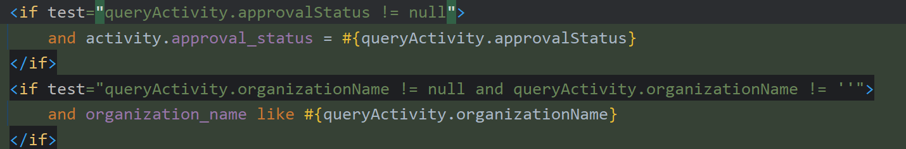

# 配置

引导类扫包范围是：引导类所在包及其子包

配置中引用配置：${引用的配置名字(.引用的配置下面的子配置名字)}


把一组配置封装到一个对象中给类读取：

比方说我想把DataSource的配置封装到一个对象

```yaml
spring:
  datasource:
    # 注意下面这里
    driver-class-name: com.mysql.cj.jdbc.Driver
    url: jdbc:mysql:///volunteer_management_activity_system
    username: root
    password: 123456
    type: com.alibaba.druid.pool.DruidDataSource
```

那就创建一个类，啥名无所谓,**但是属性名得一样！**

```java
@Data
@Component//定义为Spring管控的bean
@ConfigurationProperties(prefix = "spring.datasource")//指定加载的数据
/*
	点进ConfigurationProperties后发现属性value和prefix互为别名，所以这是前缀
*/
public class MyDataSource {
    private String driverClassName;//配置中划线分隔单词的就用驼峰命名法
	private String url;
	private String username;
	private String password;
}
```

然后在你要的类里面自动注入`MyDataSource`


# 整合JUnit

1. 测试类如果存在于引导类所在包或子包中无需指定引导类
2. 测试类如果不存在于引导类所在的包或子包中需要通过c1asses属性指定引导类
3. 

# 整合Mybatis

1. 创建工程时把MySQL和Mybatis勾上

2. 在`application.yml`中

   ```yaml
   spring:
     datasource:
       driverClassName: com.mysql.cj.jdbc.Driver
       url: jdbc:mysql:///volunteer_management_activity_system
       username: root
       password: 123456
   ```

3. 用注解写Dao层接口时，在接口上面加个`@Mapper`让容器识别到，产生自动代理的对象

4. 没了

MySQL8在低版本springboot会爆错，得把时区加上

```yaml
spring:
  datasource:
    driverClassName: com.mysql.cj.jdbc.Driver
    url: jdbc:mysql:///volunteer_management_activity_system?serverTimezone=UTC
    username: root
    password: 123456
```


# 整合Mybatis Plus

1. 导坐标

   1. 法一：服务器URL改成`https://start.aliyun.com`（但是SpringBoot的版本可能会有点低），然后去“关系型数据库”中找

   2. 法二：手动导坐标

      ```java
      <dependency>
          <groupId>com.baomidou</groupId>
          <artifactId>mybatis-plus-boot-starter</artifactId>
          <version>3.5.3.1</version>
      </dependency>
      ```

      

2. ```java
   @Mapper
   //MP和Mybatis差别就在这：不用你手写
   public interface BookDao extends BaseMapper<Book> {
   }
   ```

3. 表名要和类名一致，不一致的（比如表前有tbl_前缀）

   ```yaml
   mybatis-plus: 
     global-config: 
       db-config: 
   	  table-prefix: tbl_
   ```


4. 默认id是雪花算法，但我们想要让他按照数据库自增来

   ```yaml
   mybatis-plus:
     global-config:
       db-config:
         id-type: auto
   ```

5. 用分页查询要配置mybatis-plus的分页拦截器

   ```java
   @Configuration
   public class MPConfig{
   	@Bean
   	public MybatisPlusInterceptor mybatisPlusInterceptor(){
   		MybatisPlusInterceptor interceptor = new MybatisPlusInterceptor();
   		interceptor.addInnerInterceptor(new PaginationInnerInterceptor());
   		return interceptor;
   	}
   }
   ```

   > 在启动类所在包及其子包下面的`@Configuration`和标注的bean都会被加载

6. 开始查询

   ```java
   @Test
   void testGetBy2(){
   	String name = "1";
   	LambdaQueryWrapper<Book>lqw new LambdaQueryWrapper<Book>();
   	lqw.like(name != null, Book::getName, name);
   	bookDao.selectList(lqw);
   }
   ```

   

# 整合Druid

1. 是`Druid Spring Boot Starter`不是`Druid`!

   ```xml
   <dependency>
   	<groupId>com.alibaba</groupId>
   	<artifactId>druid-spring-boot-starter</artifactId>
   	<version>1.2.15</version>
   </dependency>
   ```

   

2. * 法一：**不推荐**，但你可以只导Druid不导那个Spring Boot专用的那个

     ```yaml
     spring:
       datasource:
         driver-class-name: com.mysql.cj.jdbc.Driver
         url: jdbc:mysql:///volunteer_management_activity_system
         username: root
         password: 123456
         type: com.alibaba.druid.pool.DruidDataSource
     ```
     
   * 法二：

     ```yaml
     # 先打个druid
     spring:
       datasource:
         druid:
           driver-class-name: com.mysql.cj.jdbc.Driver
           url: jdbc:mysql:///volunteer_management_activity_system
           username: root
           password: 123456
     ```

3. 报错：`o.s.b.d.LoggingFailureAnalysisReporter   : `

   启动类注解改成：`@SpringBootApplication(exclude = {DataSourceAutoConfiguration.class})`

   [ERROR：o.s.b.d.LoggingFailureAnalysisReporter解决办法](https://blog.csdn.net/qq_37887131/article/details/89705595)



Integer，如果判断条件加上`approvalStatus!=''`，传0进来approvalStatus语句不生效
